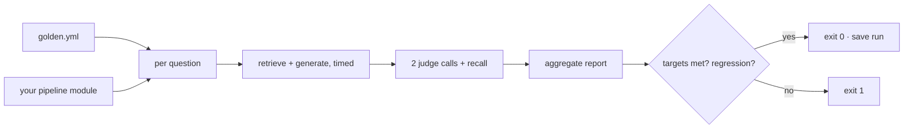

# rag-eval-harness — the merge gate for anything that touches your RAG pipeline

[](https://github.com/darrshangovender/rag-eval-harness/actions/workflows/tests.yml)
[](LICENSE)
[](https://python.org)
[](harness/judge.py)

> A focused evaluation harness for RAG pipelines. Scores faithfulness, answer relevance and retrieval recall@k over a labelled question set, compares the run against the previous one, and exits non-zero on a regression. Your pipeline plugs in through two functions.

**Why this exists.** What kills production RAG is the silent regression — you swap an embedding model or tighten a prompt and the system quietly gets worse on 8% of questions. Nobody notices until the support queue does. Eval numbers are only useful if something fails the build when they drop, so this harness is designed as a gate first and a report second.

Pairs with [rag-chatbot](https://github.com/darrshangovender/rag-chatbot) and [rag-graph](https://github.com/darrshangovender/rag-graph) — either satisfies the pipeline contract below.

---

## Quick start

```bash
pip install -e ".[dev]"
cp .env.example .env      # ANTHROPIC_API_KEY or OPENAI_API_KEY
python -m harness.run_eval --questions data/golden.yml --pipeline examples.baseline_rag
```

`--pipeline` takes a **module path**, not a file path. Run it with `-m`; `run_eval.py` uses relative imports and will not execute as a bare script.

Your pipeline plugs in by exposing two module-level functions:

```python
def retrieve(question: str) -> list[dict]:      # each dict needs "id" and "text"
    ...

def generate(question: str, chunks: list[dict]) -> str:
    ...
```

The harness handles timing, judging, aggregation, comparison and the exit code.

## How it works



1. Load the YAML question set.
2. `importlib` imports your pipeline module and asserts `retrieve` and `generate` exist.
3. Per question, time `retrieve` then `generate`; coerce the returned dicts into `Chunk(id, text)`.
4. Two judge calls (faithfulness, answer relevance) plus one deterministic recall computation.
5. Aggregate to means, with latency p50/p95.
6. Load the newest prior run from `runs/` for comparison.
7. Print the table, save the run, exit 1 on any target miss or a drop greater than 0.05.

## What it measures

| Metric | What it answers | How |
|---|---|---|
| **Faithfulness** | Are the answer's claims supported by the retrieved context? | LLM judge over answer + joined chunk texts; returns the supported-claim fraction. Target ≥ 0.90 |
| **Answer relevance** | Does the answer address the question rather than evade it? | LLM judge over question + answer only. Target ≥ 0.85 |
| **Retrieval recall@k** | Is the gold passage in the retrieved set? | `|gold ∩ retrieved| / |gold|` — deterministic, no model call. Target ≥ 0.80 |
| **Latency p50 / p95** | How slow is end-to-end answering? | Wall clock around retrieve + generate |

Targets and the 0.05 regression threshold are constants in `harness/report.py`. Change them there; they are the contract, so they belong under review.

## Design decisions

| Decision | Why |
|---|---|
| **Exit code is the product** | A report nobody reads is not a gate. The harness is built to fail a build, and the pretty table is a side effect. |
| **Two-function pipeline contract** | Anything with a retriever and a generator plugs in — including a competitor's, which is how you actually compare architectures rather than prompts. |
| **Recall is computed, not judged** | One metric in the set has to be independent of the judge, otherwise a judge regression looks like a pipeline regression. Recall is exact set arithmetic. |
| **Judge is Anthropic-first with an OpenAI fallback** | The eval shouldn't go down because one provider does. Retries are bounded at three attempts. |
| **Comparison against the previous run, not a fixed baseline** | Absolute targets catch "this is bad"; run-over-run deltas catch "this got worse", which is the failure this exists for. |

## Limitations

- **Cost per question is not implemented.** `total_cost_usd` is hardcoded to `0.0` with a TODO. Every report prints `$0.0000`. Any cost figure you have seen attached to this harness was illustrative, and has been removed from this README.
- **The judge is nondeterministic and unpinned.** No temperature is set, no seed, and the models are floating aliases. Two runs of identical code produce different faithfulness scores — so a 0.05 trip cannot currently be distinguished from judge variance. There are no repeats, no variance estimate, and no confidence interval. This is the harness's biggest structural weakness, and it is a real one for a tool whose job is deciding what is a regression.
- **`retrieval_recall` returns 1.0 when a question has no `gold_chunk_ids`.** Unlabelled questions inflate aggregate recall toward 1.0 instead of being excluded from the denominator.
- **Faithfulness is measured against what was retrieved, not against truth.** A pipeline that retrieves nothing and answers "I don't know" scores high on faithfulness and around 0.7 on relevance by explicit prompt instruction. Read recall first; faithfulness alone can be gamed by refusing.
- **`reference_answer` in the golden set is dead data.** Every question carries one and no metric reads it. There is no correctness-against-ground-truth metric here at all — only self-consistency against retrieved context.
- **Serial execution, two LLM calls per question**, with retries that also fire on unparseable judge JSON — a systematically malformed judge response costs three times.
- **The baseline is chosen by filename sort** over `runs/`. A stray or differently-formatted JSON silently changes what you are compared against.
- **The shipped `data/golden.yml` has four questions.** It demonstrates the format. It is not a benchmark, and no run results are committed to this repo.

## Project layout

```
rag-eval-harness/
├── harness/
│   ├── run_eval.py       # entrypoint: load · run · judge · aggregate · gate
│   ├── metrics.py        # faithfulness · answer_relevance · retrieval_recall
│   ├── judge.py          # Anthropic-first judge with OpenAI fallback + retries
│   └── report.py         # targets, regression check, Rich table, run persistence
├── examples/
│   └── baseline_rag.py   # toy 3-document pipeline showing the contract
└── data/golden.yml       # 4 labelled demo questions
```

## Tests

```bash
pytest tests/ -q
```

**There is currently no test suite in this repo** — no `tests/` directory and no test functions. The only CI is an eval workflow that runs the harness itself against the demo pipeline, and it needs live provider secrets, so it cannot pass on a fork. Two things need fixing before this is a credible gate: unit tests for `metrics.py` and `report.py` (both are pure functions and trivially testable with a stub judge), and a deterministic offline judge so CI does not depend on a billed API.

## Author

Darrshan Govender · [Agulhas Code](https://agulhascode.co.za) · Durban, South Africa
